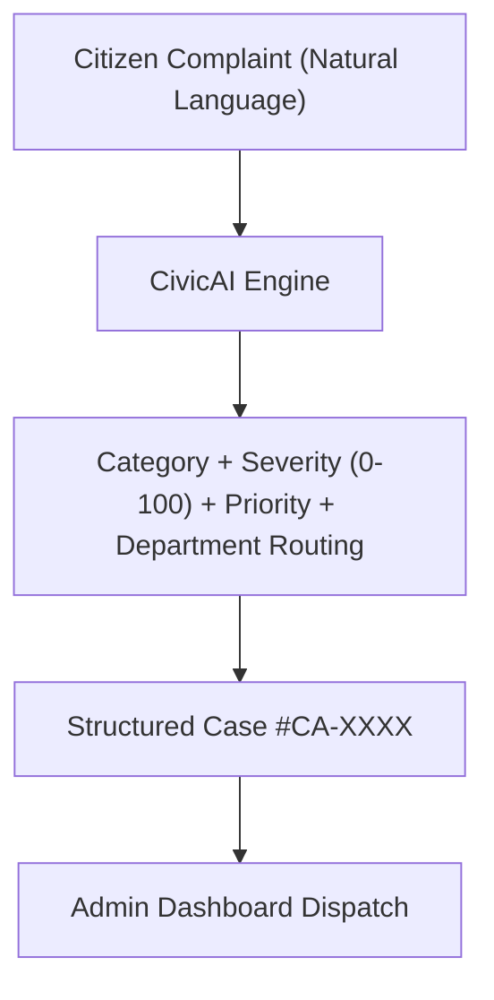

# CivicAI — Citizen Grievance Intelligence System

> **Track 1: AI for Digital Public Infrastructure & Governance**  
> **Tagline:** AI-powered citizen grievance intelligence for faster public-service response.

---

## 📌 Overview

CivicAI converts unstructured citizen complaints submitted in natural language into actionable, structured cases for municipal public-service teams.

### Core User Flow


---

## ✨ Key Features

- **AI Classification:** Converts raw complaint text into standard municipal categories (*Road Infrastructure*, *Water & Sanitation*, *Electricity*, *Waste Management*, *Public Safety*, *Public Transport*).
- **Smart Prioritization:** Generates dynamic severity scores (0–100) and maps priority levels (`HIGH`: 80–100, `MEDIUM`: 50–79, `LOW`: 0–49).
- **Department Routing & Field Actions:** Generates specific recommended actions and assigns responsible municipal departments.
- **Offline / Grounded Fallback Mode:** Operates seamlessly with Google Gemini API or deterministic local fallback analyzer for demo reliability.
- **Admin Dashboard:** Real-time KPI stats (*Total*, *High Priority*, *Pending*, *Resolved*), live filters, search bar, and status management.

---

## 🛠️ Tech Stack

- **Framework:** Next.js 14 (App Router)
- **Language:** TypeScript
- **Styling:** Tailwind CSS & Lucide Icons
- **AI Integration:** Google Gemini API (`@google/generative-ai`) with Local Fallback Engine

---

## 🚀 Quick Start

1. **Install dependencies:**
   ```bash
   npm install
   ```

2. **Run Development Server:**
   ```bash
   npm run dev
   ```
   Open [http://localhost:3000](http://localhost:3000) in your browser.

3. **Build Production Application:**
   ```bash
   npm run build
   ```

---

## 🧪 Demo Scenarios (Hyderabad Examples)

1. **Pothole (High Priority):**  
   *"There is a huge pothole near MJCET and two accidents happened there this week."*
2. **Water Leakage:**  
   *"There has been a water leakage near Mehdipatnam for three days."*
3. **Streetlight Failure:**  
   *"The streetlight near the college road has not been working for several nights."*
4. **Garbage Accumulation:**  
   *"Garbage has not been collected from our street for four days."*
5. **Damaged Road:**  
   *"The road near the bus stop is badly damaged."*