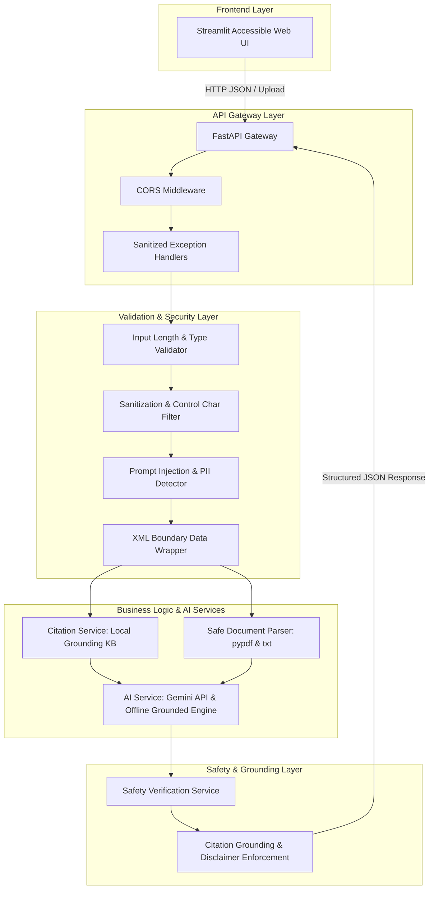

# NyayaAI Architecture & Security Specification

NyayaAI is an AI-assisted legal access platform engineered to bridge the justice gap for everyday individuals by providing clear, accessible, and grounded legal information.

---

## Technical Architecture

---

## Security Model & Threat Defense

### 1. Threat: Prompt Injection (User Input & Uploaded Documents)
- **Mitigation**: All user-provided strings and extracted document text are sanitized (null-byte removal) and enclosed inside XML data tags (`<untrusted_user_input>` and `<untrusted_document_data>`).
- **Pre-execution Scanning**: System scans for injection directives (`ignore previous instructions`, `DAN mode`, `reveal secrets`) and rejects suspicious requests before sending to LLM.

### 2. Threat: Hallucinated Legal Citations
- **Mitigation**: AI generation is grounded strictly against `data/demo_sources.json`.
- **Post-Verification**: Post-processing step validates every cited source ID against the known legal knowledge base. Unverified citations are flagged with `[UNVERIFIED CITATION]`.

### 3. Threat: Secret Exposure & Stack Trace Leaks
- **Mitigation**: Centralized configuration (`config.py`) loads secrets solely from environment variables. Global 500 error handlers sanitize errors to prevent leaking internal tracebacks or keys.

### 4. Threat: Malicious File Execution & Memory Exhaustion
- **Mitigation**: Uploaded files are restricted to `.txt`, `.pdf`, `.md` with a 2MB max file size limit. Extracted text is capped at 8,000 characters.

---

## API Endpoints Overview

| Method | Endpoint | Description |
| :--- | :--- | :--- |
| `GET` | `/api/v1/health` | Health check & AI engine status |
| `POST` | `/api/v1/legal/query` | Everyday language legal query processing |
| `POST` | `/api/v1/legal/analyze-document` | Upload & analyze legal document (.txt, .pdf, .md) |
| `GET` | `/api/v1/legal/sources` | List verified local knowledge base legal sources |

---

## Accessibility & Inclusive Design

NyayaAI adheres to WCAG accessibility principles:
- **High Contrast Palette**: Clean contrast ratios for high readability.
- **Screen Reader Support**: Semantic HTML structure (`role="alert"`, `aria-label`).
- **Structured Output**: Clear 5-part breakdown (User Facts, Sources, Explanation, Limitations, Next Steps).
